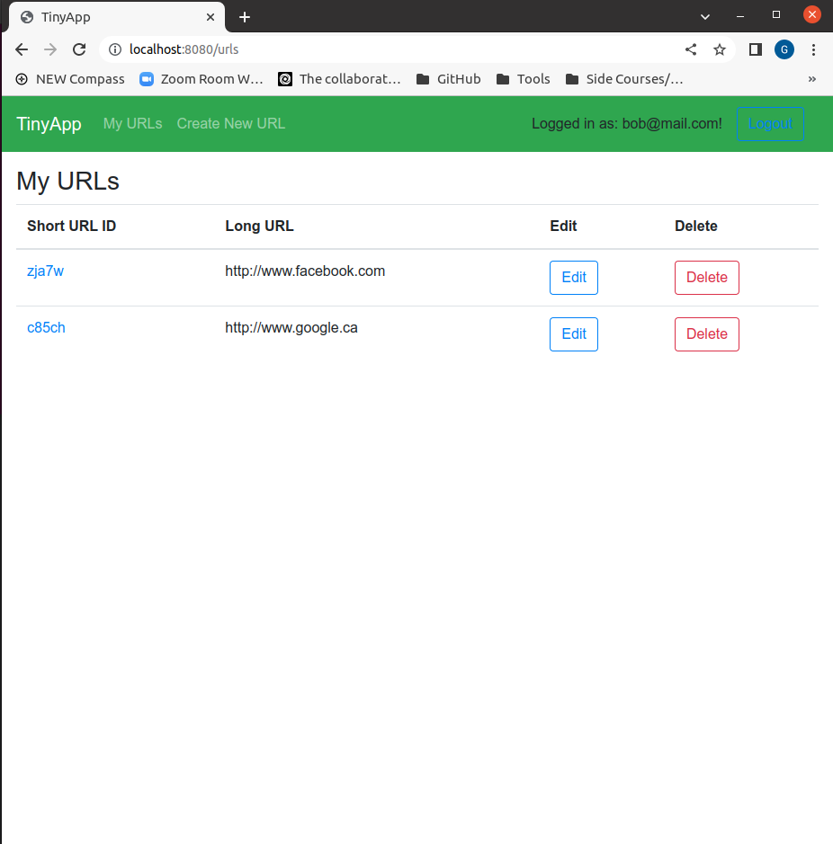
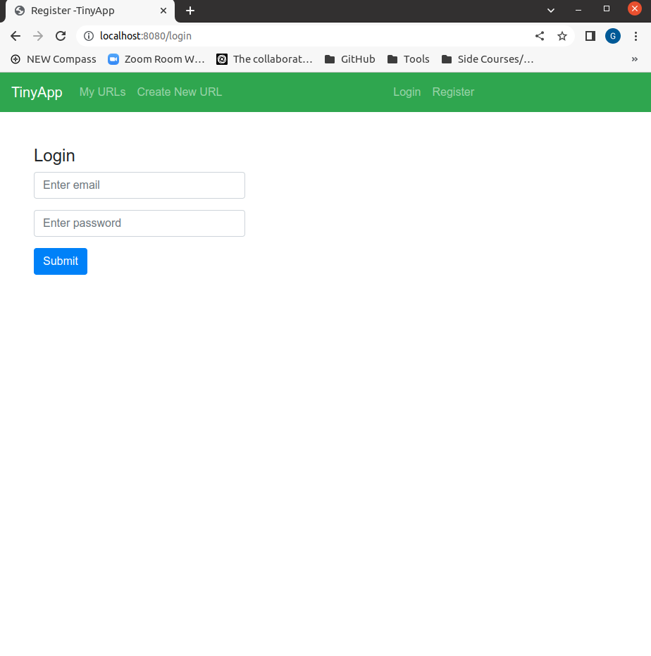
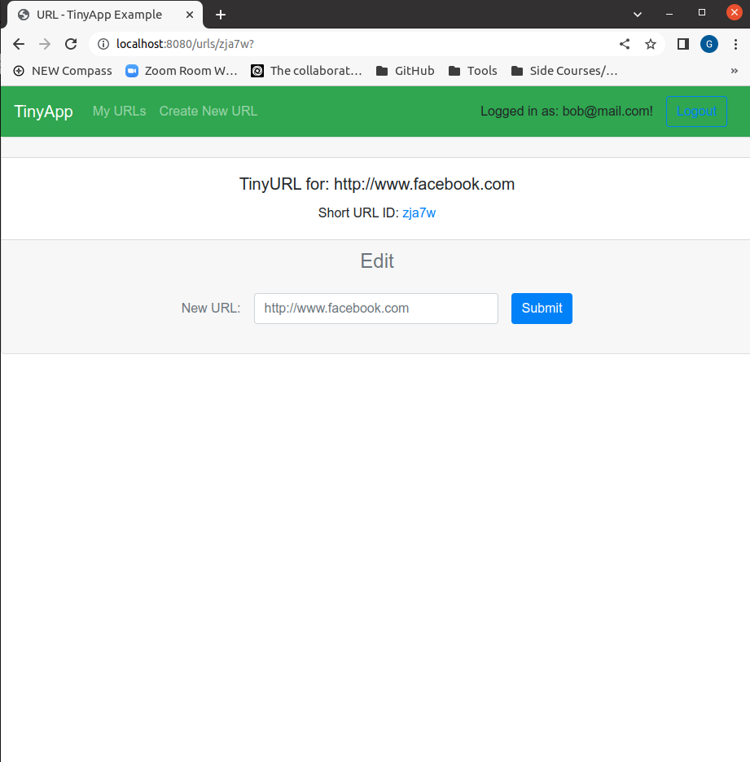

# TinyApp Project

TinyApp is a full stack web application built with Node and Express that allows users to shorten long URLs (à la bit.ly).

## Final Product

## Dependencies

- Node.js
- Express
- EJS
- bcryptjs
- cookie-session

## Getting Started

- Install all dependencies (using the `npm install` command).
- Run the development web server using the `node express_server.js` command.

## How To Use TinyApp

### Register/Login

Users must be logged in to create new links, view them, and edit them.

Just click Register on right top, put in your email and password, and you're free to create, edit, and view your new links.

### Create New Links

Just click Create New URL on navigation bar, then simply enter the long URL you want to shorten.

### Edit or Delete Short Links

In My URLs, you can delete any link you want.

You can also click Edit, and then enter a new long URL to update your link. It will be the same short URL, but redirect to an updated long URL.

### Use Your Short Link

The path to use any short link is /u/:shortLink. This will redirect you to the long URL.

You can also reach this by clicking the link under the Short URL header on the My URLs page.